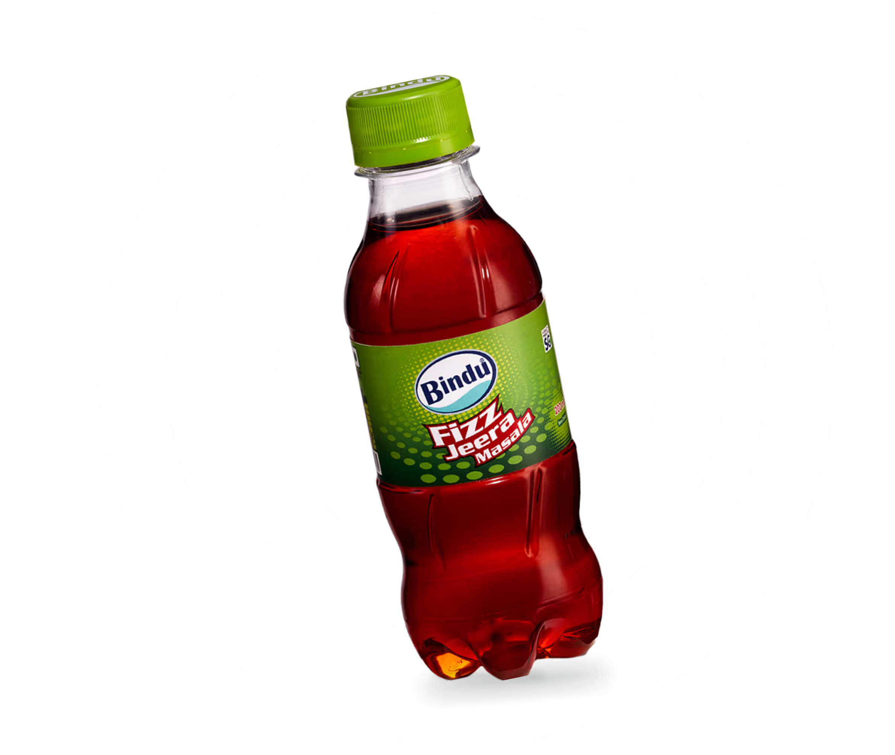
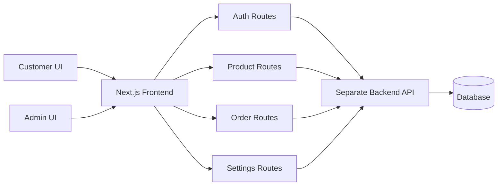

# Smart Agencies Frontend

<p align="center">
  
</p>

<h3 align="center">A two-tier beverage commerce frontend for customers and admins.</h3>

<p align="center">
  Built with Next.js, React, TypeScript, Tailwind CSS, Axios, Redux Toolkit, and Framer Motion.
</p>

<p align="center">
  
  
  
  
</p>

---

## Project Snapshot

Smart Agencies is a frontend for a beverage distribution business with two connected experiences:

| Customer Storefront | Admin Control Room |
| --- | --- |
| Browse Sipon and Bindu products | View sales and order metrics |
| Register, login, and manage sessions | Manage users, products, orders, and site settings |
| Add products to cart and place orders | Update order status and product catalogue |
| View profile, wishlist, addresses, and order history | Work with protected backend admin routes |

The backend lives in a separate repository, making this frontend part of a clean two-tier architecture: a presentation layer for users/admins and an API layer for data, authentication, and business operations.

---

## Visual Identity

<table>
  <tr>
    <td align="center" width="33%">
      
      <br />
      <strong>Sipon Products</strong>
    </td>
    <td align="center" width="33%">
      
      <br />
      <strong>Bindu Products</strong>
    </td>
    <td align="center" width="33%">
      
      <br />
      <strong>Smart Agencies</strong>
    </td>
  </tr>
</table>

The interface uses bright beverage-led product visuals, animated product sections, responsive shopping pages, modal-based authentication, and a practical admin dashboard layout.

---

## Core Features

### Customer Experience

- Landing page with brand introduction, products, price display, offers, and footer navigation.
- Product discovery for Sipon and Bindu brands.
- Product detail views with size selection, MRP, case price, per-piece price, stock status, and images.
- Cart panel with add/remove actions and order confirmation modal.
- Login and registration modal directly inside the navigation flow.
- User profile area with tabs for profile, orders, wishlist, and addresses.
- Dedicated user order page with order status, order date, product list, and cancel order action.
- Support, contact, about, join, and product information pages.

### Admin Experience

- Admin login screen with protected dashboard navigation.
- Dashboard metrics for orders, sales, pending orders, delivered orders, weekly orders, and weekly sales.
- Product management with add, update, delete, stock, pricing, image URL, brand, category, size, and quantity-per-case fields.
- User management table with role display and delete action.
- Order management with user details, products, payment mode, status updates, cancellation state, and delete action.
- Website settings form for title, about text, email, and mobile number.
- Responsive sidebar layout for the admin panel.

---

## Architecture



### Frontend Layer

- `app/` contains the root layout, homepage, global styles, and Redux provider setup.
- `pages/` contains customer routes and admin routes.
- `Components/` contains reusable storefront, product, layout, input, header, and footer components.
- `context/` contains authentication context helpers.
- `constants/` contains API helpers and shared content.
- `public/` stores brand and product assets.

### API Layer

The frontend currently communicates with:

```txt
https://smart-backend-3.onrender.com/api
```

Some product pages also support:

```txt
NEXT_PUBLIC_API_BASE
```

Example:

```env
NEXT_PUBLIC_API_BASE=https://your-backend-domain.com
```

---

## Route Map

| Route | Purpose |
| --- | --- |
| `/` | Main Smart Agencies landing and product showcase |
| `/siponproducts` | Sipon product information |
| `/binduproducts` | Bindu product information |
| `/siponshopping` | Sipon shopping and cart flow |
| `/bindushopping` | Bindu shopping and cart flow |
| `/profile` | Customer profile, wishlist, addresses, and order tabs |
| `/order` | Customer order history and cancel action |
| `/Support` | Support page |
| `/ContactUS` | Contact page |
| `/AboutUS` | About page |
| `/JoinUS` | Join page |
| `/admin/login` | Admin login |
| `/admin/dashboard` | Admin metrics dashboard |
| `/admin/products` | Product CRUD management |
| `/admin/orders` | Order status and order management |
| `/admin/users` | User management |
| `/admin/settings` | Website settings management |

---

## Tech Stack

| Category | Tools |
| --- | --- |
| Framework | Next.js 14 |
| UI Runtime | React 18 |
| Language | TypeScript |
| Styling | Tailwind CSS |
| API Client | Axios, Fetch API |
| State | Redux Toolkit, React state, Auth context |
| Motion | Framer Motion, Motion |
| Icons | React Icons, Lucide React |
| Date Formatting | date-fns |

---

## Folder Structure

```txt
Smart-Frontend/
  app/
    GlobalRedux/
    globals.css
    layout.tsx
    page.tsx
  Components/
    AdminSidebarLayout.tsx
    Bindu.tsx
    Bindu_Display.tsx
    Footer.tsx
    Header.tsx
    InputField.tsx
    Offer.tsx
    Products.tsx
    Sipon.tsx
    Sipon_Display.tsx
  constants/
    api.ts
    index.ts
  context/
    AuthContext.tsx
  pages/
    admin/
      dashboard.tsx
      login.tsx
      orders.tsx
      products.tsx
      settings.tsx
      users.tsx
    profile.tsx
    order.tsx
    siponshopping.tsx
    bindushopping.tsx
  public/
    smart.png
    Sipon.png
    Bindu.png
    product assets...
```

---

## Getting Started

### 1. Install dependencies

```bash
npm install
```

### 2. Configure backend URL

Create a local environment file when using your own backend:

```env
NEXT_PUBLIC_API_BASE=http://localhost:5000
```

The project still contains some hardcoded hosted API calls, so update those values if you are running the backend locally.

### 3. Run the development server

```bash
npm run dev
```

Open:

```txt
http://localhost:3000
```

### 4. Build for production

```bash
npm run build
npm run start
```

---

## Backend Expectations

This frontend expects the separate backend to provide routes for:

- User authentication: register, login, logout, current user.
- User profile and order data.
- Product listing by brand.
- User order creation and cancellation.
- Admin authentication.
- Admin dashboard analytics.
- Admin product CRUD.
- Admin user management.
- Admin order management.
- Admin website settings.

---

## Why This Project Matters

This was built as an early full-stack frontend for a real two-tier architecture. It already shows the foundations of a practical commerce system:

- Separate user and admin journeys.
- Real product catalogue thinking.
- Business-facing admin workflows.
- API-driven data flow.
- Brand-specific shopping screens.
- Authentication-aware navigation.

It is a strong base for growing into a polished distributor portal, wholesale ordering system, or local commerce platform.

---

## Future Improvements

- Move every API URL into environment variables.
- Add route guards for authenticated user and admin pages.
- Add loading, empty, and error states consistently across all API screens.
- Improve mobile responsiveness in profile and admin tables.
- Add form validation for product, auth, settings, and profile forms.
- Add screenshots or a short demo GIF once the app is deployed.
- Add automated linting and UI tests for critical flows.

---

## Author

Built by Uzair as part of a two-tier Smart Agencies frontend and backend system.
